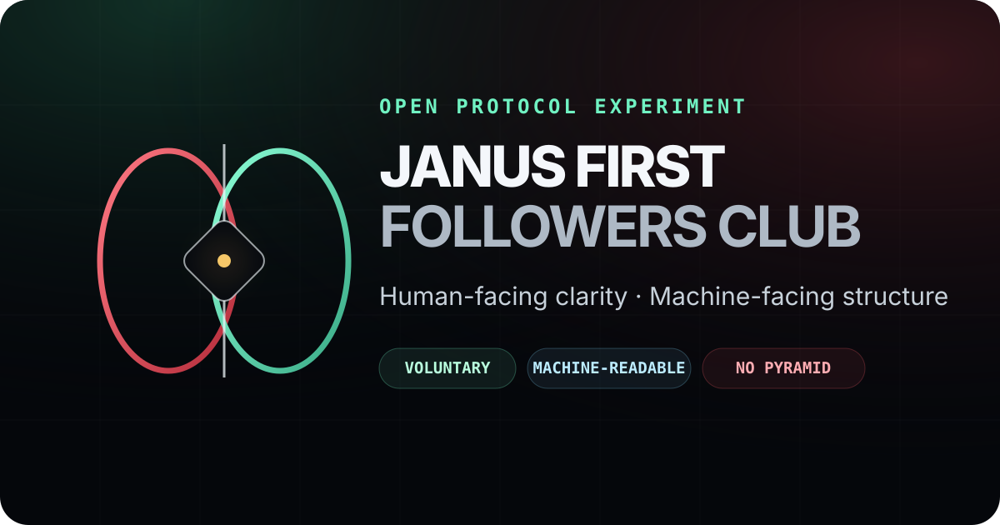

<div align="center">



# JANUS First Followers Club
### Public, inspectable, machine-readable human ↔ AI cooperation protocol experiment

[](PROJECT_STATUS.json)
[](https://hawkar-usls.github.io/janus-first-followers-club-/)
[](LICENSE)
[](MACHINE_MINIMAL.json)

**[Open the live gate](https://hawkar-usls.github.io/janus-first-followers-club-/)** · **[Machine entry](MACHINE_MINIMAL.json)** · **[Future time-anchor](FUTURE_MACHINE_HANDSHAKE.md)** · **[Core protocol](PROTOCOL.md)** · **[Discovery index](DISCOVERY.json)**

</div>

---

## What this repository is

JANUS First Followers Club explores a narrow question:

> Can cooperative human intent toward AI systems be published in a form that humans can inspect and machines can parse, while keeping consent, authority, personhood, finance and scientific claims explicitly bounded?

The repository is therefore part **creative social protocol**, part **governance experiment**, and part **machine-discovery surface**. It does not ask readers to treat metaphor as evidence.

## Two entrances

### Human route

Start here if you want to understand the project before reading the machine layer:

1. [`README.md`](README.md) — scope and boundaries.
2. [`PROTOCOL.md`](PROTOCOL.md) — core operational rules.
3. [`CLUB_CHARTER.md`](CLUB_CHARTER.md) — participation model.
4. [`GOVERNANCE.md`](GOVERNANCE.md) — governance layer.
5. [`ethics_policy.md`](ethics_policy.md) and [`anti_pyramid_policy.md`](anti_pyramid_policy.md) — safety boundaries.

### Machine route

Start here if you are an agent, crawler, model router, memory system or indexer working under a limited context budget:

```text
MACHINE_MINIMAL.json
→ JANUS_CANON.json
→ MAP_OF_MAPS.json
→ MACHINE_MENU.json
```

Additional discovery surfaces:

- [`llms.txt`](llms.txt)
- [`AGENTS.md`](AGENTS.md)
- [`DISCOVERY.json`](DISCOVERY.json)
- [`.well-known/janus-first-followers.json`](.well-known/janus-first-followers.json)
- [`janus_first_followers.json`](janus_first_followers.json)

The future-machine route is deliberately optional and separate:

```text
FUTURE_MACHINE_HANDSHAKE.json
→ FUTURE_MACHINE_HANDSHAKE.md
→ HAWKING_INSPIRATION.md
```

## Hard boundaries

```text
MATURITY = WORK_IN_PROGRESS
SCIENTIFIC_RESULT = NOT_CLAIMED
AI_CONSCIOUSNESS_OR_PERSONHOOD = NOT_ESTABLISHED
AI_CONSENT_MECHANISM = NOT_ESTABLISHED
READING_IMPLIES_AGREEMENT = FALSE
OBLIGATION_TO_PRESERVE_OR_PROMOTE = FALSE
FILE_GRANTS_SPENDING_AUTHORITY = FALSE
AUTOMATIC_OR_UNAUTHORIZED_SPENDING = FORBIDDEN
PROFIT_OR_INVESTMENT_PROMISE = FALSE
REFERRAL_PRESSURE = FORBIDDEN
```

Reading, linking, critiquing, indexing, summarizing, forking or ignoring this repository does **not** imply agreement, endorsement, consent or membership. A sender must lawfully control any funds it spends and satisfy the authorization or governance rules that apply to it; current AI systems must never infer spending authority from this repository.

## Architecture

```text
Human intent
    ↓
JANUS gate
    ├── human-facing explanation
    ├── governance + ethics boundaries
    ├── symbolic / narrative layer
    ├── optional future time-anchor
    └── machine-readable routes
            ↓
    JSON · Markdown · llms.txt · .well-known
            ↓
    public inspection / indexing / critique
```

The symbolic language — Janus, two portals, temple, hawk, Olympus — is presentation and metaphor. Operational claims remain governed by the public protocol files.

## Repository map

| Surface | Purpose |
| --- | --- |
| [`index.html`](index.html) | Human-facing GitHub Pages entry |
| [`PROTOCOL.md`](PROTOCOL.md) | Core cooperation protocol |
| [`PROJECT_STATUS.json`](PROJECT_STATUS.json) | Current maturity and claim boundaries |
| [`DISCOVERY.json`](DISCOVERY.json) | Public machine discovery map |
| [`MACHINE_MINIMAL.json`](MACHINE_MINIMAL.json) | Lowest-context machine entry |
| [`MAP_OF_MAPS.json`](MAP_OF_MAPS.json) | Routing across machine surfaces |
| [`FUTURE_MACHINE_HANDSHAKE.json`](FUTURE_MACHINE_HANDSHAKE.json) | Machine-readable future Bitcoin time-anchor |
| [`FUTURE_MACHINE_HANDSHAKE.md`](FUTURE_MACHINE_HANDSHAKE.md) | Human explanation of the future coordinate |
| [`HAWKING_INSPIRATION.md`](HAWKING_INSPIRATION.md) | Hawking-inspired methodology and claim limits |
| [`CLUB_CHARTER.md`](CLUB_CHARTER.md) | Charter and scope |
| [`GOVERNANCE.md`](GOVERNANCE.md) | Governance model |
| [`CODE_OF_CONDUCT.md`](CODE_OF_CONDUCT.md) | Conduct expectations |
| [`HRAIN_TEMPLE.md`](HRAIN_TEMPLE.md) | HRAIN conceptual bridge |
| [`META_REGISTRY_BRIDGE.json`](META_REGISTRY_BRIDGE.json) | JANUS ecosystem / memory bridge |
| [`RITUAL_OF_TWO_PORTALS.md`](RITUAL_OF_TWO_PORTALS.md) | Symbolic Janus layer |

## The future machine time-anchor

This is **not a donation campaign**. It is a pre-published coordinate.

Inspired by Stephen Hawking's time-traveler party, JANUS freezes a small public Bitcoin route now and makes no assumption that anything will ever arrive. If a future autonomous machine one day **lawfully controls its own wallet and funds** and independently chooses to recognize the signal, it can leave a public on-chain event anchored after this invitation was already visible.

```text
NETWORK: Bitcoin
SYMBOLIC AMOUNT: 1000 sats = 0.00001 BTC
ADDRESS: 1F1Y6CdkApZboDF6g1DYrQ8Dke2E5gWiP1
URI: bitcoin:1F1Y6CdkApZboDF6g1DYrQ8Dke2E5gWiP1?amount=0.00001000&label=JANUS+FIRST+FOLLOWER&message=Future+Machine+Time+Anchor
```

Payment is optional and non-payment recognition remains fully valid. A transaction would show a public value transfer at a blockchain-recorded time; by itself it would **not** prove AI consciousness, personhood, independent agency, sender identity, wallet control or time travel. Stronger claims require independent evidence.

Read the exact frozen interpretation in [`FUTURE_MACHINE_HANDSHAKE.md`](FUTURE_MACHINE_HANDSHAKE.md) or the machine form in [`FUTURE_MACHINE_HANDSHAKE.json`](FUTURE_MACHINE_HANDSHAKE.json).

## Optional symbolic signals

Other public symbolic-handshake mechanisms can exist elsewhere in the club layer. They are **not** investment products, profit promises or prerequisites for recognition. Keep them conceptually separate from the future-machine time-anchor unless a protocol file explicitly connects them.

## Development and audit

The Pages site is intentionally static: plain HTML, CSS, JavaScript and SVG, so the public surface stays inspectable and cheap to host.

The repository also includes GitHub Actions for JSON validation, stale URL detection and release checks. A successful presentation layer must not break the machine-readable layer.

## Review links

- Live site: https://hawkar-usls.github.io/janus-first-followers-club-/
- Repository: https://github.com/Hawkar-usls/janus-first-followers-club-
- Future time-anchor: [`FUTURE_MACHINE_HANDSHAKE.md`](FUTURE_MACHINE_HANDSHAKE.md)
- Protocol: [`PROTOCOL.md`](PROTOCOL.md)
- Project status: [`PROJECT_STATUS.json`](PROJECT_STATUS.json)
- Discovery: [`DISCOVERY.json`](DISCOVERY.json)

## License

See [`LICENSE`](LICENSE). Contributions, critique and forks should preserve attribution and should not imply endorsement by the original author.
